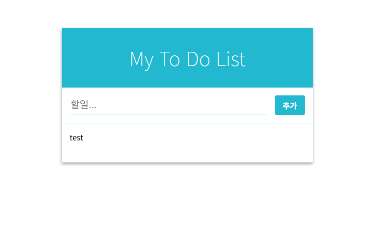
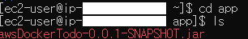

# TodoApp in AWS EC2
- mysql + SpringBoot 프로젝트인 Todo를 AWS 서버에 올리는 실습 과정을 기록한 readme 파일

## 1. restexam 프로젝트에서 Todo 관련 파일 추출
- 새 프로젝트를 생성, 기존 프로젝트에서 build.gradle, Todo와 관련된 controller, domain, dto, repository, service를 복사해 옮긴다.
- 서버를 기동, 동작이 잘 되는지 테스트 (다른 테스트를 하면서 사용중인 포트와 겹치지 않는지 확인할 것)



## 2. AWS 서버로 옮겨줄 jar 파일 생성
- 터미널에서 프로젝트 경로로 이동, ./gradlew clean build -x test 명령어로 jar 파일을 생성

## 3. EC2 인스턴스 생성
- 생성 시 인바운드 규칙에서 포트 범위 22는 SSH 접속할 때 사용하므로 내 아이피만 허용하는게 안전
- 8080 포트는 누구나 접근할 수 있게 0.0.0.0/0 으로 설정 (테스트니까)

## 4. AWS 접속
- SSH 접속 명령어
```
ssh -i C:\Users\YourName\Downloads\key.pem ec2-user@<EC2_PUBLIC_IP>
```
- key.pem은 본인의 키 이름을 입력
- <EC2_PUBLIC_IP>는 본인이 생성한 EC2 인스턴스의 public IP 주소 사용

### 4-1. Permission Denied로 인해 접속이 불가한 경우
- Windows powershell에서 진행할 것
```

# 1. 상속된 권한 제거 (기존 권한 초기화)
icacls.exe "lion-key.pem" /reset

# 2. 현재 사용자에게만 '읽기(Read)' 권한 부여
icacls.exe "lion-key.pem" /grant:r "$($env:USERNAME):R"

# 3. 상속 권한 차단 (다른 사용자 접근 불가)
icacls.exe "lion-key.pem" /inheritance:r
```

- 접속 성공 시 보이는 화면
```
   ,     #_
   ~\_  ####_        Amazon Linux 2023
  ~~  \_#####\
  ~~     \###|
  ~~       \#/ ___   https://aws.amazon.com/linux/amazon-linux-2023
   ~~       V~' '->
    ~~~         /
      ~~._.   _/
         _/ _/
       _/m/'

[ec2-user@ip-172-31-x-x ~]$
```

## 5. 서버 초기 환경 설정
### 패키지 업데이트
```
sudo uim update -y
```
### java 21 설치
```
# Java 21 설치
sudo yum install -y java-21-amazon-corretto

# 설치 확인
java -version
```
설치 완료
```
openjdk version "21.0.1" 2023-10-17 LTS
OpenJDK Runtime Environment Corretto-21.0.1.12.1 (build 21.0.1+12-LTS)
OpenJDK 64-Bit Server VM Corretto-21.0.1.12.1 (build 21.0.1+12-LTS, mixed mode, sharing)
```

### 작업 디렉토리 생성:
```
# 애플리케이션 디렉토리 생성
mkdir -p ~/app
cd ~/app
```

## 6. AWS 서버로 파일 전송
```
scp -i C:\Users\YourName\Downloads\spring-boot-key.pem `
    build\libs\your-app-0.0.1-SNAPSHOT.jar `
    ec2-user@<EC2_PUBLIC_IP>:/home/ec2-user/app/
```
- pem과 jar 파일은 본인의 사용하는 이름으로 변경
- 전송 완료 확인  


## 7. JAR 파일 실행 (테스트용 포그라운드)
