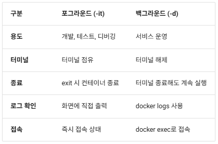

## Docker 데몬 (Docker Engine)
- Docker 데몬(dockerd)은 호스트 시스템에서 실제 컨테이너 생성, 실행, 중지 등 핵심 작업을 수행하는 백그라운드 프로세스

## Docker 클라이언트 (docker CLI)
- 사용자가 명령어를 입력하는 프론트엔드
- docker 명령어를 통해 Docker 데몬과 통신

## 이미지
- 애플리케이션 실행에 필요한 파일, 라이브러리, 환경설정을 묶은 템플릿 (읽기 전용)
- 나만의 이미지 제작도 가능
- 태그로 버전 구분

## 컨테이너
- 이미지로 만들어 낸 인스턴스

### docker run -d -p 8080:80 nginx --name myapp
- nginx를 호스트의 8080 포트와 컨테이너의 80 포트를 매핑해서 실행, 이름은 myapp

## docker run - 컨테이너 생성 및 실행
기본 문법 : docker run [옵션] <이미지> [명령어] [인자]
주요 옵션:

1. 대화형 모드 (-it):

```
# 터미널 접속하여 bash 실행
docker run -it ubuntu /bin/bash

# 컨테이너 내부에서 작업 가능
root@container_id:/# ls
root@container_id:/# pwd
root@container_id:/# exit  # 종료 시 컨테이너도 종료
```

2. 백그라운드 모드 (-d):
```
# 백그라운드로 nginx 실행
docker run -d nginx

# 출력: 컨테이너 ID
58c85969e4396a3b8c6e7e14c0f7e7b4e6c9e3a8f1d9c2b5a4e3f2d1c0b9a8e7

# 실행 확인
docker ps
```

3. 이름 지정 (--name):
```
# 컨테이너에 이름 부여
docker run -d --name mynginx nginx

# 이름으로 관리 가능
docker stop mynginx
docker start mynginx
docker rm mynginx
```

4. 포트 매핑 (-p):
```
# 호스트 8080 → 컨테이너 80
docker run -d -p 8080:80 nginx

# 여러 포트 매핑
docker run -d -p 8080:80 -p 8443:443 nginx

# 모든 인터페이스 바인딩
docker run -d -p 0.0.0.0:8080:80 nginx

# 특정 IP에만 바인딩
docker run -d -p 127.0.0.1:8080:80 nginx
```

5. 환경 변수 (-e):
```
# MySQL 컨테이너 실행 시 환경 변수 설정
docker run -d \
--name mysql \
-e MYSQL_ROOT_PASSWORD=mypassword \
-e MYSQL_DATABASE=testdb \
-p 3306:3306 \
mysql:8.0
```

6. 볼륨 마운트 (-v):
```
# 호스트 디렉토리를 컨테이너에 마운트
docker run -d \
--name mynginx \
-v /home/user/html:/usr/share/nginx/html \
-p 8080:80 \
nginx

# Named Volume 사용
docker run -d \
--name mysql \
-v mysql-data:/var/lib/mysql \
mysql:8.0
```

7. 자동 삭제 (--rm):
```
# 컨테이너 종료 시 자동 삭제 (일회용 컨테이너)
docker run --rm -it ubuntu /bin/bash

# 종료 후 docker ps -a 에 나타나지 않음
```

8. 자원 제한:
```
# 메모리 제한
docker run -d --memory="512m" nginx

# CPU 제한 (1 CPU = 1.0)
docker run -d --cpus="0.5" nginx

# 메모리 + CPU 동시 제한
docker run -d --memory="1g" --cpus="1.0" nginx
```

9. 재시작 정책 (--restart):
```
# 항상 재시작 (호스트 재부팅 후에도)
docker run -d --restart always nginx

# 실패 시에만 재시작
docker run -d --restart on-failure nginx

# 실패 시 최대 3번 재시작
docker run -d --restart on-failure:3 nginx

# 재시작 안 함 (기본값)
docker run -d --restart no nginx
조합 예시 (실무):


# Spring Boot 애플리케이션 컨테이너
docker run -d \
--name myapp \
--restart always \
-p 8080:8080 \
-e SPRING_PROFILES_ACTIVE=prod \
-e DB_HOST=mysql-server \
-v /var/log/myapp:/logs \
--memory="2g" \
--cpus="1.5" \
myapp:v1.0
```
## 컨테이너 제어 명령어
1. 중지 (docker stop):
```
# 정상 종료 (SIGTERM → SIGKILL)
docker stop mynginx

# 여러 컨테이너 동시 중지
docker stop web1 web2 web3

# 모든 실행 중인 컨테이너 중지
docker stop $(docker ps -q)

# 타임아웃 설정 (기본 10초)
docker stop -t 30 mynginx
```

2. 시작 (docker start):
```
# 중지된 컨테이너 재시작
docker start mynginx

# 여러 컨테이너 시작
docker start web1 web2

# 시작과 동시에 로그 확인
docker start -a mynginx
```

3. 재시작 (docker restart):
```
# 중지 후 다시 시작
docker restart mynginx

# 타임아웃 설정
docker restart -t 5 mynginx
```

4. 일시 중지 (docker pause/unpause):
```
# 프로세스 일시 중지 (SIGSTOP)
docker pause mynginx

# 재개
docker unpause mynginx
```

5. 강제 종료 (docker kill):
```
# 즉시 종료 (SIGKILL)
docker kill mynginx

# 특정 시그널 전송
docker kill --signal=SIGTERM mynginx
```

6. 삭제 (docker rm):
```
# 중지된 컨테이너 삭제
docker rm mynginx

# 강제 삭제 (실행 중이어도)
docker rm -f mynginx

# 여러 컨테이너 삭제
docker rm web1 web2 web3

# 중지된 모든 컨테이너 삭제
docker rm $(docker ps -aq -f status=exited)

# 볼륨도 함께 삭제
docker rm -v mynginx
```

## 실무 시나리오:
```
# 1. 컨테이너 재배포 (이미지 업데이트 후)
docker stop myapp
docker rm myapp
docker pull myapp:v2.0
docker run -d --name myapp myapp:v2.0

# 2. 빠른 재시작 (설정 파일 변경 후)
docker restart myapp

# 3. 긴급 종료
docker kill myapp
```
## 포그라운드 vs 백그라운드 모드
포그라운드 모드 (-it):

- 특징:

  - 현재 터미널이 컨테이너의 표준 입력/출력에 연결
  - 대화형 모드: 사용자 입력 가능
  - 터미널 종료 시 컨테이너도 종료<br><br>

- 사용 예:

```
# Ubuntu 컨테이너로 즉시 접속
docker run -it ubuntu /bin/bash

# Python 대화형 셸
docker run -it python:3.11 python

# Node.js REPL
docker run -it node:18 node
```
옵션 설명:

- -i (--interactive): 표준 입력(STDIN) 유지
- -t (--tty): 가상 터미널(TTY) 할당
- 보통 -it 함께 사용

## 백그라운드 모드 (-d):

특징:

터미널 점유 없이 백그라운드에서 실행
데몬(daemon) 프로세스처럼 동작
터미널 종료해도 컨테이너 계속 실행
사용 예:

```
# 웹 서버를 백그라운드로 실행
docker run -d -p 8080:80 nginx

# 데이터베이스 서버 (cmd의 경우 ^로 줄바꿈)
docker run -d \
--name mysql \
-e MYSQL_ROOT_PASSWORD=password \
mysql:8.0

# 로그는 docker logs로 확인
docker logs mysql

# 필요 시 exec로 접속
docker exec -it mysql mysql -uroot -p
```


## docker logs - 로그 확인

기본 사용:
```
# 컨테이너의 표준 출력 로그 확인
docker logs mynginx
```

실시간 모니터링:
```
# tail -f 처럼 실시간 로그 확인
docker logs -f mynginx

# Ctrl+C로 종료 (컨테이너는 계속 실행)
```

최근 로그만 확인:
```
# 최근 100줄
docker logs --tail 100 mynginx

# 최근 10줄 + 실시간 추적
docker logs --tail 10 -f mynginx
```

시간 필터:
```
# 최근 10분간의 로그
docker logs --since 10m mynginx

# 특정 시각 이후
docker logs --since 2025-03-09T10:00:00 mynginx

# 특정 시각 이전
docker logs --until 2025-03-09T11:00:00 mynginx

# 시간 범위 지정
docker logs --since 10m --until 5m mynginx
```

타임스탬프 표시:
```
# 각 로그 라인에 타임스탬프 추가
docker logs -t mynginx
```

출력 예시:
```
2025-03-09T10:15:42.123456789Z 172.17.0.1 - - [09/Mar/2025:10:15:42 +0000] "GET / HTTP/1.1" 200 612
2025-03-09T10:15:43.234567890Z 172.17.0.1 - - [09/Mar/2025:10:15:43 +0000] "GET /favicon.ico HTTP/1.1" 404 555
```

로그 저장:
```
# 로그를 파일로 저장
docker logs mynginx > nginx.log 2>&1 
# mynginx를 nginx.log에 저장하고 
# 에러(2)는 첫번째 나온 파일(&1, nginx.log)에 저장

# 에러 로그만 저장
docker logs mynginx 2> nginx-error.log
```

실무 활용:
```
# Spring Boot 애플리케이션 에러 확인
docker logs --tail 50 myapp | grep ERROR

# 특정 문자열 포함 로그만
docker logs myapp | grep "Exception"

# 실시간으로 에러 모니터링
docker logs -f myapp | grep -i error
```

## 컨테이너 정리
```
중지된 컨테이너 확인:


# 중지된 컨테이너 목록
docker ps -a --filter "status=exited"
```

개별 삭제:
```
# 컨테이너 1개 삭제
docker rm mycontainer

# 여러 개 동시 삭제
docker rm container1 container2 container3
```

일괄 삭제:
```
# 중지된 모든 컨테이너 삭제
docker rm $(docker ps -aq --filter "status=exited")

# 모든 컨테이너 삭제 (실행 중 제외)
docker rm $(docker ps -aq)

# 강제로 모든 컨테이너 삭제 (실행 중 포함)
docker rm -f $(docker ps -aq)
```

특정 조건 컨테이너 삭제:
```
# 24시간 이상 중지된 컨테이너
docker ps -a --filter "status=exited" --filter "exited=0" | \
awk '{if(NR>1) print $1}' | xargs docker rm

# 특정 이름 패턴
docker rm $(docker ps -a --filter "name=test" -q)
```

## 이미지 정리

이미지 목록 확인:
```
# 모든 이미지
docker images

# 댕글링 이미지 (<none> 태그)
docker images --filter "dangling=true"
```

출력 예시:
```
REPOSITORY    TAG       IMAGE ID       CREATED        SIZE
nginx         latest    605c77e624dd   2 weeks ago    141MB
ubuntu        22.04     08d22c0ceb15   3 weeks ago    77.8MB
<none>        <none>    a1b2c3d4e5f6   1 month ago    250MB
```

개별 삭제:
```
# 이미지 1개 삭제
docker rmi nginx:latest

# IMAGE ID로 삭제
docker rmi 605c77e624dd

# 여러 개 동시 삭제
docker rmi nginx ubuntu redis
```

댕글링 이미지 삭제:
```
# <none> 태그 이미지 모두 삭제
docker rmi $(docker images -f "dangling=true" -q)
```

강제 삭제:
```
# 사용 중인 이미지도 강제 삭제
docker rmi -f nginx

# 모든 이미지 강제 삭제 (주의!)
docker rmi -f $(docker images -q)
```

### 실행 중인 컨테이너가 사용하는 이미지는 삭제 불가
- 컨테이너 먼저 중지 후 삭제
- -f 옵션으로 강제삭제 (비권장)

## docker 네트워크
- 대부분 bridge 사용

docker run -d --name web1 nginx  
docker run -d --name web2 nginx 로 컨테이너 두개 생성  

docker inspect web1으로 해당 컨테이너의 네트워크 정보 확인  
docker exec web2 ping [web1의 IP주소]
- 둘은 같은 네트워크에 있어서 핑이 잘 동작함

docker network create --driver bridge my-bridge로 새 네트워크 생성  
docker network inspect [네트워크 이름] 으로 IP주소 확인가능, 새 네트워크는 기존과 IP 주소의 범위가 다르다.  
```
# my-web1이라는 이름의 nginx 컨테이너를 my-bridge 네트워크에 생성하겠다.
docker run -d --name my-web1 --network my-bridge nginx
```

web2에서 my-web1으로는 ping을 해도 아무 반응이 없다 = 네트워크 연결이 안되어있다.
```
docker exec web2 ping [my-web1의 IP주소]
_ # 반응 없음
```

my-bridge 네트워크의 my-web2 nginx 컨테이너를 하나 생성, ping을 설치 후 my-web1으로 날리면
같은 네트워크 안에 있기 때문에 잘 동작함을 알 수 있다. (ping 설치는 생략)
```
docker exec my-web2 ping my-web1    
# 사용자 정의 bridge는 자동 DNS 해석을 하기 때문에 컨테이너 이름을 입력하면 알아서 IP주소를 찾아준다.
```

docker network connect my-bridge web1 명령어로 web1을 my-bridge 네트워크에 연결한다.  
이러면 my-web2에서 web1으로 ping이 가능

## 통신 흐름 요약
컨테이너 간 통신:

- 같은 bridge 네트워크에 있으면 서로 통신 가능
- 사용자 정의 bridge: 컨테이너 이름으로 DNS 해석
- 기본 bridge: IP 주소로만 통신

호스트 ↔ 컨테이너:
- 호스트에서 컨테이너 접근: `docker0` 인터페이스 또는 포트 매핑
- 컨테이너에서 호스트 접근: 호스트 IP로 NAT 통해 가능

외부 ↔ 컨테이너:
- 포트 매핑(-p) 또는 별도 프록시/로드밸런서 설정 필요

## Host 모드
컨테이너가 호스트의 네트워크 스택을 직접 사용하는 모드입니다.

### 특징
- NAT 없이 호스트 IP/포트 직접 공유
- 포트 매핑(-p) 불필요
- 네트워크 성능 향상
- 포트 충돌 가능성 있음

### 장점
- NAT 오버헤드 없어 네트워크 성능 향상
- 설정이 간단 (포트 매핑 불필요)
- 호스트 IP로 바로 접근 가능

### 단점
- 여러 컨테이너가 동일 포트 사용 시 충돌
- 네트워크 격리 수준이 낮아짐
- 호스트와의 분리 약화

### 실무 활용
- 로컬 개발 시 성능 테스트
- 네트워크 집약적인 애플리케이션
- 특정 상황에서만 선택적으로 사용

## None 모드
컨테이너에 네트워크 인터페이스가 전혀 없는 완전 격리 모드입니다.

### 특징:
- 네트워크 인터페이스 없음
- 외부 통신 불가능
- 최대 보안 격리

### 장점:
- 완전한 네트워크 격리 → 보안 강화
- 네트워크 공격 표면 제거
- 오프라인 처리가 필요한 경우 유용

### 단점:
- 외부와 통신 불가능
- 로그 전송, API 호출 등 모두 불가
- 매우 특수한 용도로만 사용

### 실무 활용:
- 네트워크 없는 배치 프로세스
- 보안 정책상 절대 네트워크 연결 불가한 작업
- 민감한 데이터 처리 작업

## docker 이미지
### 레이어(Layer) 개념
Docker 이미지는 여러 레이어가 쌓여 있는 형태

핵심 개념:

각 레이어는 파일 시스템 변경사항(추가, 수정, 삭제)을 보관
레이어는 읽기 전용
최종적으로 합쳐서 하나의 파일시스템 구성
Union FS(Overlay2 등)를 사용해 레이어 병합

### 레이어 구조 예시
```
FROM ubuntu:22.04         
RUN apt-get update && apt-get install -y python3  
COPY . /app               
CMD ["python3", "/app/app.py"]
```
- Dockerfile이 있는 디렉토리에 app.py 파일 추가 (이미지 생성 후 동작하는 파일)
```
def main() : print("Hello from yang")

if __name__ == "__main__" : main()
```

### 이미지 생성 
- docker build -t myimage:latest .
- 명령에 맨 끝 .은 현재 디렉토리를 뜻하는 표시 (빠뜨리지 않도록 주의할것)