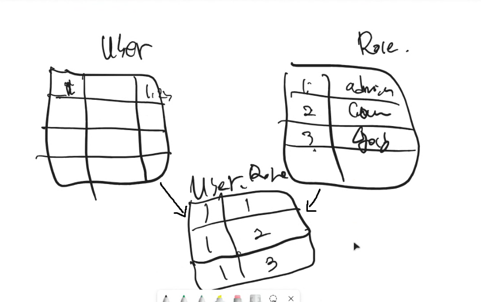

## JDBC를 사용해야 하는 이유
- 자바에서 DB에 데이터를 CRUD하기 위해서는 JDBC가 필요, 기술이 이거 밖에 없음
- JDBC 코드를 일일이 만들기에는 어렵고 비효율적임, 편하게 제공되는 프레임워크가 있음
- Spring JDBC는 쿼리주고 만들어달라하면 우리가 아는 JDBC 코드가 그대로 만들어짐
- JPA는 ORM이라는 기술 사용
- 쿼리를 던져주고 여기에 담아줘 이게 아니라 JPA가 동작하는 방식이 따로 있어서 거기에 맞게
- 영속성 컨텍스트를 사용해서 JDBC 코드를 자동으로 만들어냄

## JPA
- 엔티티를 영속성 컨텍스트에 맡겼더니 알아서 진행됨
- 엔티티 중요
  - 클래스 명 : 주로 단수를 씀
  - 테이블 명 : 주로 복수를 씀
  - 클래스, 테이블 명은 다를 수 있음

## 연관관계
- 테이블끼리는 foreign key를 가지고 테이블끼리 연결할 수 있는데
- 객체끼리는 서로를 포함할 수 있음, 이러면 DB는 연결되어 있는걸 모르니까 연관관계 매핑을 시켜줘서 알려줘야 함
- 1:1(일대일), 1:N(일대다), N:1(다대일), N:M(다대다) 관계가 있음
- 실무에서는 양방향 관계를 쓸 때 주의해야함, 서로가 서로를 참조할 수 있기 때문
- 연관관계에 대한 정보를 갖고 있는 쪽을 주인으로 봄 (Foreign key가 있는 테이블)

      예시) School, Student
      Student가 재학중인 학교정보를 갖고 있음 -> 주인, student 객체에서 school 객체를 만들어서 변수로 갖고 있음
      school은 mappedBy = "school"로 둘의 관계를 정의함

### 다대다 연결 방법
- User와 Role 테이블이 있고 만약에 여러 Role을 가지고 있는 User가 있다면
- Role을 저장하는 UserRole 테이블을 따로 만들어서 1번 유저는 1,2,3번 role을 가지고 있다는 식으로 표현하면 됨
- 요약 : 중간 테이블 필요

## @OneToMany
- 일대다 양방향 연관관계
- 앞에 나온게(One) 나, 뒤에 나온게(Many) 필드 : 일대다

## @ManyToOne
- 다대일

## Cascade, orphanRemoval
- Cascade는 부모 엔티티의 영속성 상태 변화를 자식 엔티티에 전파하는 옵션
- 부모 삭제 시 자식도 삭제 같은 옵션이 가능
- orphanRemoval은 부모와의 관계가 끊어진 자식 엔티티를 자동으로 삭제하는 기능
  - 부모-자식 관계가 명확하고 자식이 독립적으로 존재할 이유가 없을 때 사용

## 다대다 연결
- 각 객체가 서로의 리스트를 가지고 있으면 됨
- @ManyToMany로 연결
- JoinTable을 둘 중 하나에 넣으면 됨

## Spring DATA JPA
- 인터페이스에 JpaRepository 상속받아서 사용

## JUnit 테스트
- BeforeEach로 테스트 환경 동일하게 설정 가능