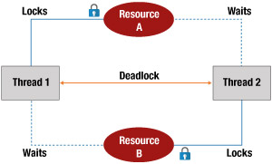

## wait(), notify(), notifyAll()
- 우선순위를 확실하게 해야할 때 사용 (우선순위 보장)
- wait() : 대기
- notify() : 대기중인 쓰레드 활성화
- notifyAll() : 대기중인 "모든" 쓰레드 활성화

## join()
- 다른 스레드의 종료를 기다림

## interrupt()
- 쓰레드를 안전하게 중단

## 우선순위
- setPriority (우선순위를 보장해주지는 않음)
  - Thread.MAX_PRIORITY : 10
  - Thread.MIN_PRIORITY : 1

## 데드락
- 둘 이상의 스레드가 서로가 가진 리소스를 기다리며 무한 대기하는 상태

- 발생 조건
  1. 상호배제 : 리소스를 한 번에 한 스레드만 사용
  2. 점유와 대기 : 리소스를 점유하면서 다른 리소스 대기
  3. 비선점 : 강제로 리소스를 뺏을 수 없음
  4. 순환대기 : 리소스 대기가 순환 구조<br></br>

- 해결방법
  1. 락 순서 통일
  2. 타임아웃 설정 

## 스레드 풀
- 스레드를 여러 개 만들어놓고 쓸 수 있음

## Future와 Callable
- 결과를 반환하는 비동기 작업

## CountDownLatch
- 모든 스레드가 끝날때까지 대기했다가 진행하게 함

## ConcurrentHashMapExample
- 스레드 안전한 HashMap

## ThreadLocal
- 클라이언트가 서버에 요청을 보내면 요청한 클라이언트마다 스레드가 생성됨
- 스레드마다 영역이 생김

## 스레드
- 스레드 생성, start()
- 직접 스레드 상속 받거나, Runnable 구현하거나
- 여러 스레드가 하나의 공유자원, 공유객체를 공유할 때 문제가 생김

## Synchronized
- Synchronized 블록이 너무 크면 안좋음

## 스레드 풀
- 스레드를 사용할 때 마다 생성하는게 비효율적
- 미리 생성해놓고 사용

## 1급 시민
- 변수에 담을 수 있다.
- 함수의 인자로 전달할 수 있다.
- 함수의 반환값으로 전달할 수 있다.

## 함수적 인터페이스
- 메소드가 하나만 있는 인터페이스 ex) Runnable -> Run() 하나만 있음
- 함수적 인터페이스는 @FunctionalInterface 어노테이션을 붙여서 표현

## 람다식
- 함수적 인터페이스를 구현하는 익명 개체를 생성하는 방법
```java
Runnable r = () -> { 
    System.out.println("익명 구현 객체가 출력합니다."); 
};
r.run();
```

## 자바 표준 함수적 인터페이스 활용
## Function
- 매개변수 하나, 다른 타입 반환

## Supplier
- 입력은 없고 출력만 하는 인터페이스

## Consumer
- 입력만 받고 소비만 함 (출력 없음)

## Predicate
- 매개변수 하나를 받고 boolean 타입으로 반환