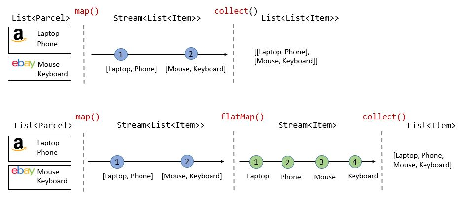

## 스트림
- 데이터의 추상화된 연속된 흐름
- stream 메소드 호출 시 자료구조에 있는 데이터를 꺼내서 stream에 꺼내놓고 흘려보냄
- 스트림은 데이터를 저장하지 않고 처리
- 한번 쓰면 끝, 다시 쓰려면 스트림을 재생성해야 함.

## 스트림의 정적 메소드
- Stream.of() : 스트림 값 직접 설정
- Stream.iterate() : 무한 스트림 생성 (0, n -> n+2 등 조건을 줘서 무한생성, .limit(10) 등으로 개수 제한 가능)
- Stream.generate() : 무한 스트림 생성 (Math::random 같은거로 무한생성, .limit(10) 등으로 개수 제한 가능)

## 스트림 연산의 구분
- 중간 연산 : 스트림을 반환하며 연쇄가 가능
- 최종 연산 : 결과를 반환하며 스트림을 소비
```java
List<String> names = Arrays.asList("Alice", "Bob", "Charlie", "David", "Eve");

List<String> result = names.stream()
        .filter(name -> name.length() > 3)    // 중간 연산: 필터링
        .map(String::toUpperCase)              // 중간 연산: 변환
        .sorted()                              // 중간 연산: 정렬
        .collect(Collectors.toList());         // 최종 연산: 수집

System.out.println(result); // [ALICE, CHARLIE, DAVID]
```

## Map, flatMap

- 플랫맵을 쓰면 여러 리스트가 있어도 한줄로 다 펴줌

## 정렬
- .sorted() : 오름차순
- .sorted(Comparator.reverseOrder()) : 내림차순
- .sorted(Comparator.comparingInt(String::length)) : 길이 기준 정렬

## forEach, peek
- forEach는 최종연산
- peek는 중간연산(디버깅용), 동작 자체는 forEach와 동일하지만 다시 스트림을 반환함


## 매칭과 검색
### 매칭
- allMatch - 모든 요소가 조건 만족, 진행하다가 조건에 안맞으면 바로 종료
- anyMatch - 하나라도 조건 만족
- noneMatch - 모든 요소가 조건 불만족

### 검색
- findFirst - 첫 번째 요소
- findAny - 아무 요소나 (병렬 처리 시 유용)

## 집계
- count : 요소 개수
- min : 최솟값
- max : 최댓값

### 숫자 스트림 집계
- mapToInt : IntStream으로 변환하여 집계

## 리듀싱과 수집
### reduce 연산
- 합계 구하기, 최댓값 구하기, 문자열 연결
### Collectors를 이용한 수집
- toList, toSet, toMap으로 수집
- collectors로 수집한 list는 가변 리스트

## Optional
- null 처리 같은 것들을 잊어버리는 실수를 방지할 수 있다
- 값이 있을 때와 없을 때의 처리를 각각 다르게 할 수 있다
- 예시는 OptionalTest.java 파일 참고

## groupingBy를 이용한 그룹화
```java
// 부서별 그룹화
Map<String, List<Employee>> byDepartment = employees.stream()
    .collect(Collectors.groupingBy(Employee::getDepartment));
```

## partitioningBy를 이용한 분할
```java
// 짝수와 홀수로 분할
Map<Boolean, List<Integer>> evenOddPartition = numbers.stream()
    .collect(Collectors.partitioningBy(n -> n % 2 == 0));
```
- 분류하고 난 나머지 부분은 버리는게 아니라 그 부분도 사용할 수 있음
- n % 2 == 0가 true일 때와 false 때 모두 사용 가능

## 병렬 스트림
- 작업을 여러 스레드로 나눠서 진행
### 주의사항
- 스레드 오버헤드: 작은 데이터셋에서는 오히려 성능 저하
- 순서 보장 안됨: 순서가 중요한 경우 사용 주의
- 스레드 안전성: 공유 자원 접근 시 동기화 필요
- Boxing/Unboxing 비용: 기본형 특화 스트림 사용 권장