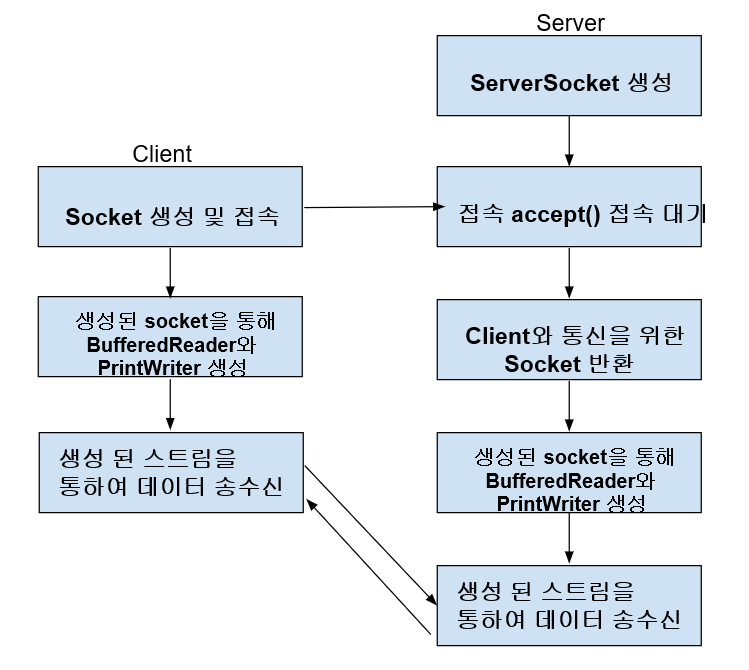

# 네트워크 프로그래밍

## IP
- Internet Protocol Address

### 공인IP
- ISP가 제공하는 전세계적으로 유일한 IP주소
- 직접 접근 가능

### 사설IP
- 가정이나 회사 내부 네트워크에서 사용
- 외부에서 직접 접근 불가
- NAT으로 접근

## TCP (Transmission Control Protocol)
- 신뢰성 있는 데이터 전송을 보장하는 연결 지향적 프로토콜

## InetAddress
- IP 주소 표현, 관리용 클래스
- IPv4, IPv6 주소를 추상화하여 제공

## 서버
- 서버 소켓을 열고 accept를 통해서 기다림, 연결이 되면 클라이언트 소켓이 열림(리턴)
- 소켓으로부터 인풋 아웃풋을 얻어냄

## 클라이언트
- 서버와 클라이언트 각각 연결 통로가 하나씩 있어서 다른 클라이언트가 접속해도
- 통신이 안됨 -> 멀티쓰레드로 동작하면 해결

- 서버가 입력받는 통로 = 클라이언트가 출력하는 통로
- 서버가 출력하는 통로 = 클라이언트가 입력받는 통로