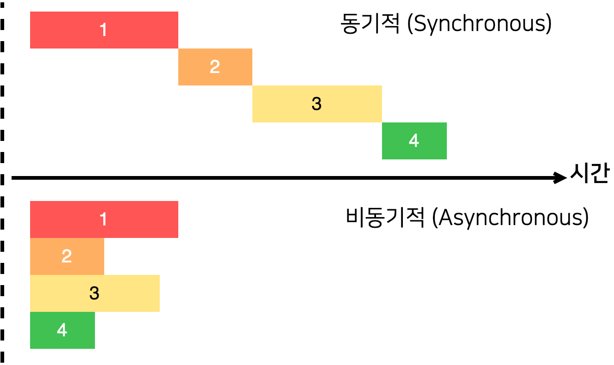
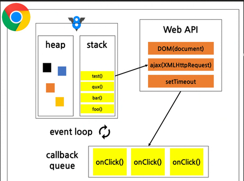

## 자바스크립트
- 인터프리터 언어지만 읽기전에 전체적으로 변수등을 확인하고 해석함
- 함수 오버로딩 없음

## 화살표 함수
- 일반함수와 화살표함수를 서로 변환할 줄 알아야함
- 객체 안에서는 화살표 함수 불가능 (this의 범위가 전역으로 되어있어서)

## 구조 분해 할당
- react 등에서 많이 사용

## forEach()
- 매개변수로 함수를 넘김 (매개변수함수()로 넘기면 함수 실행 결과값을 넘김)
- forEach(함수명) 으로 사용할것
- forEach(화살표함수)도 많이 사용

## map()
- 각 요소에 무언가(함수)를 하고 변경한 값들을 새 배열에 반환.

## filter()
- 참인것만 배열에 담아서 리턴. (필터링, 조건선별)

## reduce()
```javascript
// reduce -- 값을 누적하는 함수 
// a : 누적값, c : 다음요소, {} : 두개로 수행할 함수, 0 : a의 초기값(생략 시 첫번째 요소로 설정)
let sum = array.reduce((a, c) => {
  //   console.log(a);
  return a + c;
}, 0);
```

## 동기 처리
- 작업이 끝날 때까지 기다림

## 비동기 처리
- 작업을 시작하고 다른 작업 진행



- stack이 비워진 후에 실행 됨, stack에 있는 값을 이용해야 한다면 같이 싸서 Web API로 보냄

### async/await
```javascript
// Promise 생성
function delay(ms) {
  return new Promise((resolve, reject) => {
    setTimeout(() => {
      resolve(`${ms}ms 대기 완료`);
    }, ms);
  });
}

// async 함수
async function fetchData() {
  try {
    console.log("데이터 요청 시작");

    // 1초 대기
    await delay(1000);
    console.log("첫 번째 작업 완료");

    // 2초 대기
    await delay(2000);
    console.log("두 번째 작업 완료");

    return "모든 작업 완료!";
  } catch (error) {
    console.error("에러 발생:", error);
  }
}

// 실행
fetchData().then((result) => {
  console.log(result);
});

```

## 단축평가
- 논리연산자 AND - 둘다 참 = 참, 앞이 거짓이면 뒤는 실행 X
- OR - 앞이 참이면 뒤 실행 안함
- 자바스크립트가 거짓이라고 판단하는 값들
  - OR(||) 연산의 경우 : "", 0, null, undefined
  - ?? : 거짓을 값으로만 판단함, null, undefined 거짓

## 옵셔널 체이닝 (?.)
- 객체나 배열의 중첩된 속성에 접근할 때 존재하지 않는 경우 오류를 발생시키지 않고 undefined를 반환