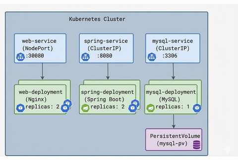
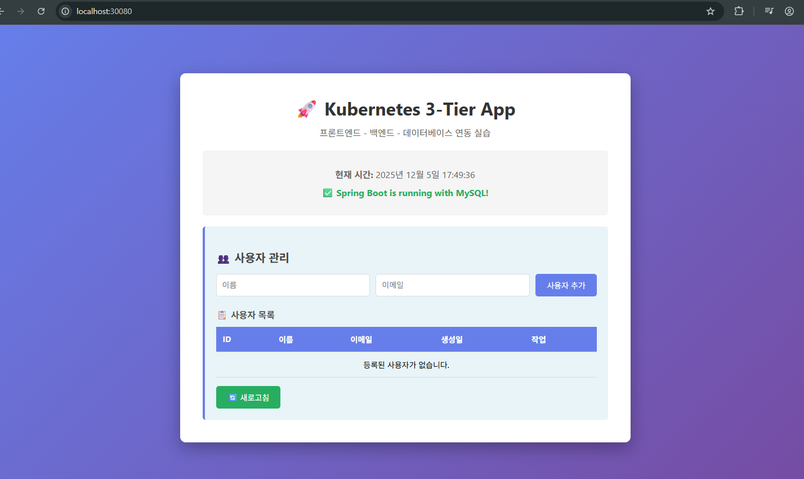

# 볼륨(Volume) - C:\docker\volume-exam에서 실습
- 쿠버네티스의 Pod와 컨테이너는 기본적으로 휘발성 스토리지를 사용
- Pod이 재시작되거나 새로 생성·삭제되는 과정에서 컨테이너 내부 데이터가 삭제됨

## 볼륨 종류
1. Ephemeral Volume(일회성 볼륨)
- Pod가 죽으면 함께 사라지는 일시적 볼륨

2. Persistent Volume (PV) + Persistent Volume Claim (PVC)
- 영구적인 스토리지를 쿠버네티스에 등록(PV)하고, 사용자는 PVC를 통해 그 스토리지를 청구(Claim)해서 Pod에 연결
- Pod이 삭제되어도, PVC/PV가 유지되는 한 데이터가 보존됨  


- 전역에서 관리자가 실제 공간 중 얼마를 쓸거라는 선언을 함(실제 사용되는 스토리지 : PV)
- 사용자는 PVC를 등록해서 PV에서 얼마를 쓰겠다 신청을 하는 구조

### pv-hostpath.yml파일
```
apiVersion: v1
kind: PersistentVolume
metadata:
  name: my-pv
spec:
  capacity:
    storage: 1Gi
  accessModes:
    - ReadWriteOnce
  hostPath:
    path: /tmp/data        # 노드의 로컬 디렉토리 (테스트용)
  persistentVolumeReclaimPolicy: Retain
```
- 주요 필드
  - capacity.storage: 이 PV가 제공하는 스토리지 용량 (1Gi)
  - accessModes: ReadWriteOnce → 한 번에 한 노드에서만 Read/Write 가능
  - hostPath.path: 실제 호스트(노드) 경로 (여기서는 /tmp/data)
  - persistentVolumeReclaimPolicy: PV가 사용 후에 삭제될 때 남은 데이터를 어떻게 처리할지(Retain, Recycle, Delete)

### Persistent Volume Claim (PVC)
- 사용자가 원하는 스토리지 용량, 접근 모드 등을 청구(Claim)
- PVC와 매칭되는 PV가 있으면 바인딩  
- PV보다 더 큰 용량을 쓰겠다고 요청 --> 바인딩되지 않음
pvc-hostpath.yml 파일
```
apiVersion: v1
kind: PersistentVolumeClaim
metadata:
  name: my-pvc
spec:
  accessModes:
    - ReadWriteOnce
  resources:
    requests:
      storage: 500Mi
```
- 주요 필드
  - accessModes: PV와 동일한 모드(ReadWriteOnce)
  - resources.requests.storage: 원하는 스토리지 크기(500Mi)
  - PV에 1Gi가 있고, 여기선 500Mi만 요청하므로 바인딩이 가능

### Deployment에서 PVC 사용
- Pod(Deployment) 에서 PVC를 참조하여 /data 경로에 마운트
```
apiVersion: apps/v1
kind: Deployment
metadata:
  name: volume-demo-deploy
spec:
  replicas: 1
  selector:
    matchLabels:
      app: volume-demo
  template:
    metadata:
      labels:
        app: volume-demo
    spec:
      containers:
      - name: nginx-container
        image: nginx:alpine
        ports:
        - containerPort: 80
        volumeMounts:
        - name: my-data-volume
          mountPath: /data         # 컨테이너 내부 경로
      volumes:
      - name: my-data-volume
        persistentVolumeClaim:
          claimName: my-pvc        # PVC 이름
```
- 주요 설정
  - volumeMounts: mountPath: /data → 컨테이너 내부 경로
  - volumes: persistentVolumeClaim.claimName: my-pvc → PVC 이름 지정

# Kubernetes 어플리케이션 배포 - c/k8s-exam/lion-k8s에서 실습
## 도커 이미지 빌드 및 실행
1. html, css, js 파일 작성

2. Dockerfile 작성
    ```
    # Nginx 경량 이미지 사용
    FROM nginx:alpine
    
    # 작성한 HTML, CSS, JS 파일을 Nginx의 웹 루트로 복사
    COPY index.html /usr/share/nginx/html/
    COPY style.css /usr/share/nginx/html/
    COPY script.js /usr/share/nginx/html/
    
    # Nginx 포트
    EXPOSE 80
    
    # 컨테이너 실행 시 Nginx 실행
    CMD ["nginx", "-g", "daemon off;"]
    ```
3. 도커 이미지 빌드 및 컨테이너 실행
4. 브라우저 접속 확인
## Spring Boot 어플리케이션 Docker 빌드
- 간단하게 REST Controller 작성
- Dockerfile 작성
    ```
    # Java 21 환경의 기본 이미지 사용
    FROM eclipse-temurin:21-jdk
    
    # 빌드된 JAR 파일 경로
    ARG JAR_FILE=build/libs/my-spring-boot-app-0.0.1-SNAPSHOT.jar
    
    # 최종적으로 해당 jar를 app.jar라는 이름으로 복사
    COPY ${JAR_FILE} app.jar
    
    # 컨테이너 8080 포트 오픈 (Spring Boot 기본)
    EXPOSE 8080
    
    # 컨테이너가 실행될 때 Spring Boot JAR 실행
    ENTRYPOINT ["java", "-jar", "/app.jar"]
    ```
- Jar 생성 : `./gradlew build`
- 빌드 : `docker build -t my-spring-boot-app:1.0 .`
- 컨테이너 실행 : `docker run -d -p 8080:8080 --name my-spring-boot-container my-spring-boot-app:1.0`

# Kubernetes 애플리케이션 배포 전략
## 배포 전략이 중요한 이유
1. 확장성(Scalability)
   - 트래픽 증가에 따라 Pod 개수를 늘리는 방법(Horizontal Scaling)
   - 또는 어플리케이션 성능을 높이기 위해 Pod 리소스(Requests/Limits) 조정

2. 고가용성(High Availability)
   - 하나의 Pod이 죽어도 서비스 중단을 최소화하기 위해 Deployment와 Service를 통한 로드밸런싱
   - 다수의 Pod을 여러 노드에 분산시켜 장애에 대한 내성을 확보

3. 무중단 업데이트(Rolling Update)
   - 신규 버전 배포 시 서비스를 완전히 끄지 않고 점진적으로 업데이트
   - 이전 버전 Pod과 새 버전 Pod을 교대로 교체, 요청 장애 시간 최소화

4. 환경 설정 분리(ConfigMap, Secret)
   - 환경별(개발/스테이징/운영) 설정을 컨테이너 이미지와 분리해서 동적 주입
   - 민감 정보(비밀번호 등)는 Secret로 안전하게 관리

## Deployment & Service 매니페스트 작성
- 웹 애플리케이션을 구동하는 Deployment와 외부 접근을 위한 Service를 하나의 YAML 파일에 기술
```
---
apiVersion: apps/v1
kind: Deployment
metadata:
  name: web-deployment
spec:
  replicas: 2
  selector:
    matchLabels:
      app: web
  template:
    metadata:
      labels:
        app: web
    spec:
      containers:
      - name: web-container
        # 앞서 빌드한 웹 애플리케이션 이미지
        # 로컬 이미지를 사용하려면 imagePullPolicy를 Never로 설정
        image: my-web-app:1.0
        imagePullPolicy: Never
        ports:
        - containerPort: 80
---
apiVersion: v1
kind: Service
metadata:
  name: web-service
spec:
  type: NodePort
  selector:
    app: web
  ports:
  - port: 80
    targetPort: 80
    nodePort: 30080  # (선택) NodePort 지정 (30000~32767 범위)
```
- Deployment 주요 설정
  - replicas: 2: Pod을 2개 실행 → 로드밸런싱 & 무중단 업데이트 대비
  - selector.matchLabels: app: web 라는 라벨을 통해 Pod을 식별
  - containers.image: my-web-app:1.0
  - imagePullPolicy: Never: 로컬 이미지를 사용 (Docker Hub에서 pull하지 않음)
  - ports.containerPort: 80 (정적 파일을 Nginx에서 제공)


- Service 주요 설정
  - type: NodePort: 로컬에서 호스트 IP와 NodePort(30080 등)로 직접 접속 가능
  - selector.app: web: app=web 라벨의 Pod에게 트래픽 전달
  - nodePort: 30080: 호스트 노출 포트

- 배포 : `kubectl apply -f web-deployment.yaml`
- deployment, pod, service 순서대로 확인

# Spring Boot 어플리케이션 Kubernetes 배포
- 사전준비
  - Spring Boot Docker 이미지: 예: my-spring-boot-app:1.0
  - 쿠버네티스 클러스터: kubectl이 정상 동작하고, 클러스터의 노드 상태가 Ready

## 배포할 리소스 구성 (Deployment & Service)
- spring-deployment.yaml 파일
```
---
apiVersion: apps/v1
kind: Deployment
metadata:
  name: spring-deployment
spec:
  replicas: 2
  selector:
    matchLabels:
      app: spring
  template:
    metadata:
      labels:
        app: spring
    spec:
      containers:
      - name: spring-container
        # 이미 빌드한 Spring Boot 이미지
        image: my-spring-boot-app:1.0
        imagePullPolicy: Never  # 로컬 이미지 사용
        ports:
        - containerPort: 8080
---
apiVersion: v1
kind: Service
metadata:
  name: spring-service
spec:
  type: NodePort
  selector:
    app: spring
  ports:
  - port: 8080
    targetPort: 8080
    nodePort: 30081    # NodePort 포트 (30000~32767 범위 내에서 선택)
```
- Deployment:
  - replicas: 2 : Spring Boot 컨테이너를 2개 실행
  - selector.matchLabels: Pod 구분을 위한 라벨(app: spring)
  - containerPort: 8080: Spring Boot 기본 포트


- Service:
  - type: NodePort: 로컬 환경에서 호스트 IP + NodePort로 접근 가능
  - selector: app: spring: app: spring 라벨 가진 Pod에 트래픽 전달
  - nodePort = 30081: 호스트에서 접근 시 사용할 포트 번호

- 리소스 생성 후 확인 (위 Kubernetes 어플리케이션 배포와 동일한 순서)

# 스케일링, 롤링 업데이트
- 스케일링 : 애플리케이션의 처리 능력을 늘리거나 줄이는 작업
- 롤링 업데이트 : 서비스 중단 없이 새 버전을 배포하는 방식
    ```
    # 새로운 이미지 버전으로 업데이트
    kubectl set image deployment/web-deployment web-container=my-web-app:2.0
    ```
    - 업데이트 진행 상황 확인
    ```
    # 롤아웃 상태 확인
    kubectl rollout status deployment web-deployment
    
    # 출력 예시:
    # Waiting for deployment "web-deployment" rollout to finish: 1 out of 2 new replicas have been updated...
    # deployment "web-deployment" successfully rolled out
    ```
- 롤백 : 새 버전에 문제가 있으면 이전 버전으로 되돌림
  - 롤아웃 히스토리 확인
  ```
  kubectl rollout history deployment web-deployment

  # 출력 예시:
  # REVISION  CHANGE-CAUSE
  # 1         <none>
  # 2         <none>
  ```
  - 이전 버전으로 롤백
  ```
  # 바로 이전 버전으로 롤백
  kubectl rollout undo deployment web-deployment
  
  # 롤백 상태 확인
  kubectl rollout status deployment web-deployment
  ```
  - 특정 버전으로 롤백
  ```
  # 특정 리비전으로 롤백
  kubectl rollout undo deployment web-deployment --to-revision=1
  ```
  
# 로깅
- Kubernetes에서 컨테이너 로그는 kubectl logs 명령으로 확인
- 기본 로그 확인
```
# Pod 목록 확인
kubectl get pods

# 특정 Pod 로그 확인
kubectl logs <pod-name>

# 예시
kubectl logs spring-deployment-xxxxx-aaaaa
```
- 라벨로 로그 확인
```
# app=spring 라벨을 가진 모든 Pod의 로그
kubectl logs -l app=spring

# 실시간으로 확인
kubectl logs -l app=spring -f
```

# 실습 - 진행 폴더 : C:\docker\k8s-exam\like-k8s

- DB 연결해서 쓰는 3-Tier Kubernetes
- 프론트엔드는 frontend 디렉토리에 생성

## web-deployment.yml 작성
```
apiVersion: apps/v1
kind: Deployment
metadata:
  name: web-deployment
  namespace: myapp # 네임스페이스 지정
spec:
  replicas: 2
  selector:
    matchLabels:
      app: web
  template:
    metadata:
      labels:
        app: web
    spec:
      containers:
        - name: web-container
          image: my-web-app:3.0
          imagePullPolicy: Never
          ports:
            - containerPort: 80
---
apiVersion: v1
kind: Service
metadata:
  name: web-service
  namespace: myapp # 네임스페이스 지정
spec:
  type: NodePort
  selector:
    app: web
  ports:
    - port: 80
      targetPort: 80
      nodePort: 30080

```

## mysql-configmap.yml 작성
```
apiVersion: v1
kind: ConfigMap
metadata:
  name: mysql-config
  namespace: myapp # 네임스페이스 지정
data:
  mysql-database: myappdb
  mysql-user: myappuser
```

## mysql-secret.yml 작성
```
apiVersion: v1
kind: Secret
metadata:
  name: mysql-secret
  namespace: myapp # 네임스페이스 지정
type: Opaque
data:
  # base64로 인코딩된 값
  # echo -n 'rootpassword' | base64 → cm9vdHBhc3N3b3Jk
  # echo -n 'myapppassword' | base64 → bXlhcHBwYXNzd29yZA==
  mysql-root-password: cm9vdHBhc3N3b3Jk
  mysql-password: bXlhcHBwYXNzd29yZA==
```

## mysql-deployment.yml 작성
```
apiVersion: apps/v1
kind: Deployment
metadata:
  name: mysql-deployment
  namespace: myapp # 네임스페이스 지정
spec:
  replicas: 1 # 데이터베이스는 보통 1개만 실행
  selector:
    matchLabels:
      app: mysql
  template:
    metadata:
      labels:
        app: mysql
    spec:
      containers:
        - name: mysql
          image: mysql:8.0
          ports:
            - containerPort: 3306
          env:
            # Secret에서 값 가져오기
            - name: MYSQL_ROOT_PASSWORD
              valueFrom:
                secretKeyRef:
                  name: mysql-secret
                  key: mysql-root-password
            - name: MYSQL_PASSWORD
              valueFrom:
                secretKeyRef:
                  name: mysql-secret
                  key: mysql-password
            # ConfigMap에서 값 가져오기
            - name: MYSQL_DATABASE
              valueFrom:
                configMapKeyRef:
                  name: mysql-config
                  key: mysql-database
            - name: MYSQL_USER
              valueFrom:
                configMapKeyRef:
                  name: mysql-config
                  key: mysql-user
          # 볼륨 마운트
          volumeMounts:
            - name: mysql-storage
              mountPath: /var/lib/mysql
      volumes:
        - name: mysql-storage
          persistentVolumeClaim:
            claimName: mysql-pvc
---
apiVersion: v1
kind: Service
metadata:
  name: mysql-service
  namespace: myapp # 네임스페이스 지정
spec:
  type: ClusterIP # 클러스터 내부에서만 접근 가능
  selector:
    app: mysql
  ports:
    - port: 3306
      targetPort: 3306
```


## mysql-pv.yml 작성
- PV : 실제 저장소를 얼마나 쓸지 정하는 부분
- PVC : PV를 얼마나 쓸지 정하는 부분

```
# PersistentVolume - 실제 저장소 정의
# 주의: PV는 클러스터 레벨 리소스이므로 namespace가 없습니다
apiVersion: v1
kind: PersistentVolume
metadata:
  name: mysql-pv
spec:
  storageClassName: manual # PV와 PVC 연결을 위해 명시
  capacity:
    storage: 1Gi
  accessModes:
    - ReadWriteOnce
  persistentVolumeReclaimPolicy: Retain
  hostPath:
    path: /data/mysql # 노드의 로컬 경로 (개발 환경용)
---
# PersistentVolumeClaim - 저장소 요청
apiVersion: v1
kind: PersistentVolumeClaim
metadata:
  name: mysql-pvc
  namespace: myapp # 네임스페이스 지정
spec:
  storageClassName: manual # PV의 storageClassName과 동일하게
  accessModes:
    - ReadWriteOnce
  resources:
    requests:
      storage: 1Gi
```

## spring-deployment.yml 작성
```
apiVersion: apps/v1
kind: Deployment
metadata:
  name: spring-deployment
  namespace: myapp # 네임스페이스 지정
spec:
  replicas: 2
  selector:
    matchLabels:
      app: spring
  template:
    metadata:
      labels:
        app: spring
    spec:
      containers:
        - name: spring-container
          image: my-spring-boot-app:2.0
          imagePullPolicy: Never # 로컬 이미지 사용
          ports:
            - containerPort: 8080
          env:
            # Secret에서 데이터베이스 연결 정보 주입
            - name: SPRING_DATASOURCE_URL
              valueFrom:
                secretKeyRef:
                  name: spring-secret
                  key: spring-datasource-url
            - name: SPRING_DATASOURCE_USERNAME
              valueFrom:
                secretKeyRef:
                  name: spring-secret
                  key: spring-datasource-username
            - name: SPRING_DATASOURCE_PASSWORD
              valueFrom:
                secretKeyRef:
                  name: spring-secret
                  key: spring-datasource-password
          # 준비 상태 체크 (MySQL 연결 확인)
          readinessProbe:
            httpGet:
              path: /api/health
              port: 8080
            initialDelaySeconds: 30
            periodSeconds: 10
          # 생존 상태 체크
          livenessProbe:
            httpGet:
              path: /api/health
              port: 8080
            initialDelaySeconds: 60
            periodSeconds: 20
---
apiVersion: v1
kind: Service
metadata:
  name: spring-service
  namespace: myapp # 네임스페이스 지정
spec:
  type: NodePort # 프론트엔드에서만 접근 / Cluster IP가 아니라 NodePort를 사용
  selector:
    app: spring
  ports:
    - port: 8080
      targetPort: 8080
      nodePort: 30081   // 사용된 nodePort의 포트넘버
```
## spring-secret.yml 작성
```
apiVersion: v1
kind: Secret
metadata:
  name: spring-secret
  namespace: myapp # 네임스페이스 지정
type: Opaque
stringData: # stringData는 base64 인코딩 없이 직접 입력 가능
  spring-datasource-url: "jdbc:mysql://mysql-service:3306/myappdb?useSSL=false&allowPublicKeyRetrieval=true&serverTimezone=Asia/Seoul"
  spring-datasource-username: "myappuser"
  spring-datasource-password: "myapppassword"
```

## 접속 결과
