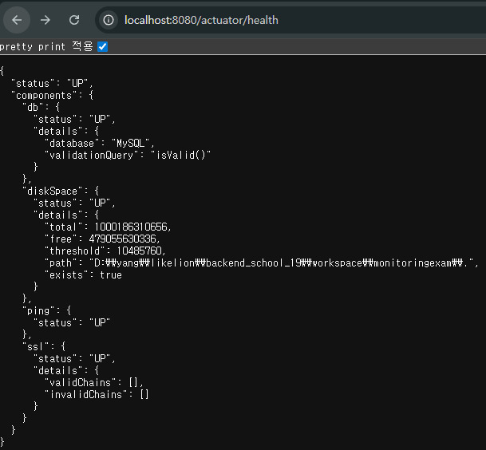

# 모니터링(Monitoring)
- 운영 중인 시스템의 상태, 성능, 가용성을 실시간으로 관찰하고 측정하는 활동
- 장애 조기 감지, 성능 최적화, 용량 계획, 사용자 경험 개선등의 기능
## Metrics (메트릭)  
- 시스템의 상태를 숫자로 표현한 측정값
    ### 1. Counter (카운터)
    - 항상 증가하는 누적 값 (절대 감소하지 않음)
    ### 2. Gauge (게이지)
    - 현재 상태를 나타내는 값 (증가/감소 모두 가능)
    ### 3. Histogram (히스토그램)
    - 값의 분포를 구간(Bucket)별로 집계
    ### 4. Summary (요약)
    - Histogram과 유사하지만, 클라이언트 측에서 백분위수를 미리 계산

## Logs (로그)
- 애플리케이션에서 발생한 이벤트의 기록

## Traces (트레이스)
- 하나의 요청이 여러 서비스를 거쳐가는 경로와 소요 시간 추적

## 실습
- 프로젝트 생성 시 SpringBoot 버전을 작성일 25.12.01 기준으로는 3.X 대 버전으로 사용하는게 좋음 (4버전은 아직 안정화되지 않았음)
- docker network 생성 (이름 : mnt-net)
- 컨테이너 생성
```
docker run -d ^
--name mnt-mysql ^
-e MYSQL_ROOT_PASSWORD=root1234 ^
-e MYSQL_DATABASE=mntdb ^
-e MYSQL_USER=mntuser ^
-e MYSQL_PASSWORD=mnt1234 ^
--network mnt-net ^
-p 3307:3306 ^
mysql:8.0
```
- application.yml 파일에 설정 추가(들여쓰기 주의)
```
management:
  endpoints:
    web:
      exposure:
        include:
          - health
          - info
          - metrics
          - loggers
          - threaddump

  endpoint:
    health:
      show-details: ALWAYS

  health:
    db:
      enabled: true
    diskspace:
      enabled: true

  info:
    env:
      enabled: true

info:
  app:
    name: "My Spring Boot Application"
    version: "1.0.0"
  team: "Backend Development Team"
```
- 제대로 추가 됐을 경우의 화면


## CustomHealthIndicator
- 어떤 패키지에 넣어야 할까
- 프로젝트 내 모든 앱이 사용하기 때문에 common이나 global 등의 패키지를 만들어서 넣어두는게 보통
- HealthIndicator 인터페이스를 implements 해야함 -> health 메소드 override 필요
- 상태가 제대로 동작하면 up, 아니라면 down이 동작하게 구현
- 클래스 위체 @Component 선언을 해야 Bean으로 등록돼서 동작함 

## 스레드 덤프 (/actuator/threaddump)
- 장애 상황 분석
- 무한 루프 또는 Deadlock 감지
- 스레드 상태 확인
```
    @GetMapping("/sleep")
    public String sleep() throws InterruptedException {
        Thread.sleep(10000);
        return "wake up";
    }
```
- 10초 대기하는 페이지 3개 정도 켜놓고 스레드 덤프에서 sleep 검색해보면 해당 스레드 확인 가능