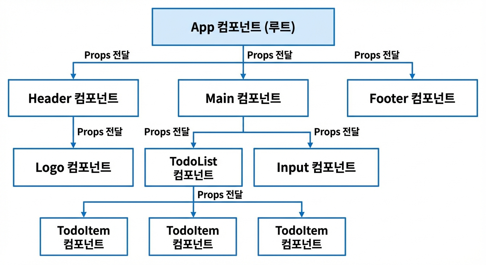
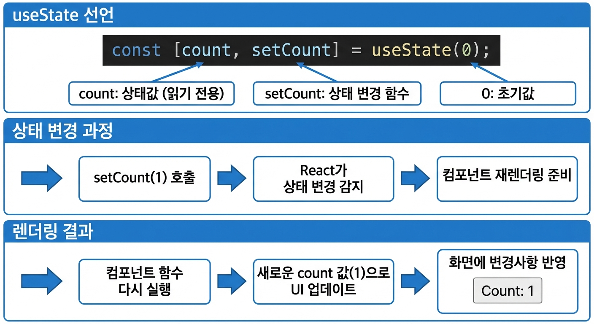

# <></> : 프래그먼트 (Fragment)
- 리액트의 jsx는 무조건 한 묶음이어야 함 그래서 의미 없는 태그를 제일 밖에 넣어서 한묶음이 되도록 만듦

# JSX
- jsx는 반드시 닫는 태그가 있어야함
- return 안에 들어가는게 jsx
- {} 안에 들어가는건 다 JS코드

# Props
- react에서 데이터는 위에서 아래로만 움직임



# 이벤트 핸들러
```javascript
const UseStateExam1 = () => {
  let count = 0;

  return (
    <div>
      <p>카운트 : {count}</p>
        <button onClick={() => console.log("HI")}>up</button>
        <button onClick={console.log("HI")}>up</button>
    </div>
  );
};
```
- 중괄호 안에 () => 없으면 함수가 전달되는게 아니라 console.log("HI")의 결과값만 보내짐
- 버튼 누르면 값이 올라가게 설정, 눌러도 화면의 값을 안변함 => 컴포넌트를 다시 올려야함
- useState 쓰면 해당 컴포넌트만 다시 그림 (전체를 다시 그리는건 낭비)

# 기본이 되는 3대 Hook
### useState
### useEffect
### useRef

# useState
- 함수형 컴포넌트에서 상태를 관리하는 Hook
```
const [상태값, 상태변경함수] = useState(초기값);
```


# 컴포넌트, props, 상태관리
- 리액트는 화면을 컴포넌트로 나눠서 관리함
  - 여러 컴포넌트로 구성된 화면일 경우 새로 갱신되는 컴포넌트만 다시 그림
- Props : properties의 줄임말, react는 데이터가 부모에서 자식으로만 흐르는 단방향 데이터 흐름을 따름
- props를 구조분해할당해서 넘겨줄 수도 있음

### page.jsx
```javascript
import Main from "./Main";
import Header from "./Header";
import Footer from "./Footer";
import Profile from "./Profile";

const Page = () => {
  const name = "caram";
  const hobbies = ["축구", "딩코", "영수"];

  return (
    <div>
      <Header />
      <Main name={name} hobbies={hobbies} />
      <Footer />
    </div>
  );
};

export default Page;
```
<br><br>
### Main.jsx
```javascript
import Profile from "./Profile";

function Main({ name, hobbies }) {
  // api 서버나, DB 등에서 값을 받아오는 코드
  // const name = "carami";
  // const hobbies = ["축구", "코딩", "영수"];

  return (
    <div>
      <p> 여기는 main. 👍 </p>
      <Profile name={name} hobbies={hobbies} />
      <Profile name={"kang"} hobbies={hobbies} />
      <Profile name={"kim"} hobbies={hobbies} />
    </div>
  );
}

export default Main;
```
<br><br>
### Profile.jsx
```javascript
function Profile({ name, hobbies }) {
  //   const name = "yang";
  //   const hobbies = ["A", "B"];

  return (
    <>
      <h1>Hi, I'm {name}</h1>
      <h2>I like {hobbies.join(",")}</h2>
    </>
  );
}

export default Profile;
```

# useState
- 함수형 컴포넌트에서 상태를 관리하는 Hook
```javascript
const [상태값, 상태변경함수] = useState(초기값);
```

```javascript
import { useState } from "react";

function TextInput() {
  const [text, setText] = useState("");

  const handleChange = (e) => {
    setText(e.target.value);
  };

  return (
    <div>
      <input
        type="text"
        value={text}
        onChange={handleChange}
        placeholder="텍스트를 입력하세요"
      />
      <p>입력한 내용: {text}</p>
    </div>
  );
}

export default TextInput;
```
- useState 쓰려면 import 해줘야함
- text: 상태값, setText: 상태 변경 함수, "": 초기값
### 동작 순서
```
input text 값 변경 -> onChange {handleChange} 동작
-> setText 호출 (e.target.value = input에 입력한 값)
-> text 값을 e.target.value로 변경 -> 컴포넌트 함수 다시 실행
-> 화면에 변경사항 반영 -> 반복
```

## 배치 업데이트와 함수형 업데이트
```javascript
// ❌ 배치 업데이트 - 세 번 호출해도 1만 증가
const handleClick = () => {
  setCount(count + 1);
  setCount(count + 1);
  setCount(count + 1);
};

// ✅ 함수형 업데이트 - 정확히 3 증가
const handleClick = () => {
  setCount(prev => prev + 1);   // 첫번째 인자에 최신 state 값 넣음
  setCount(prev => prev + 1);
  setCount(prev => prev + 1);
};
```
- 함수형 업데이트는 최신 state값을 가져와서 사용하기 때문에 +1을 여러번 넣는것도 잘 적용됨
- 배치 업데이트는 세개 모두 count가 0이었던 시점의 값을 참조하기 때문에 셋다 1로 만들어달라는 요청을 하는것