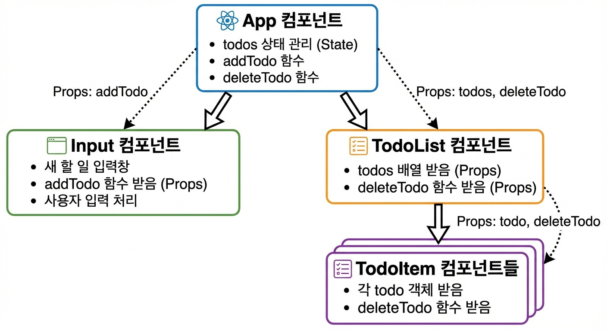
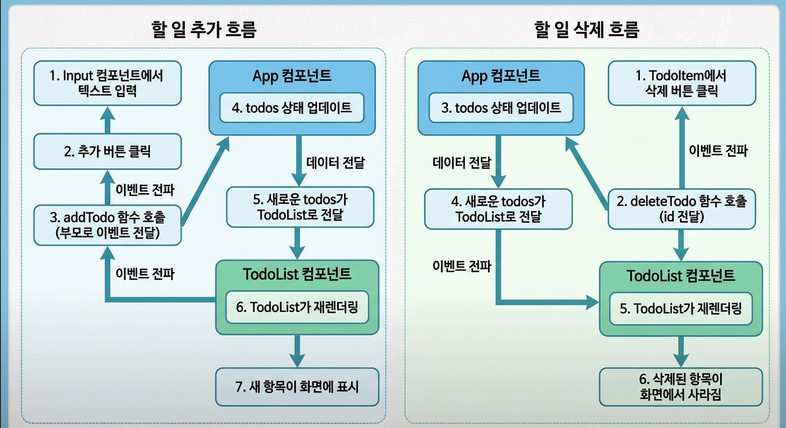
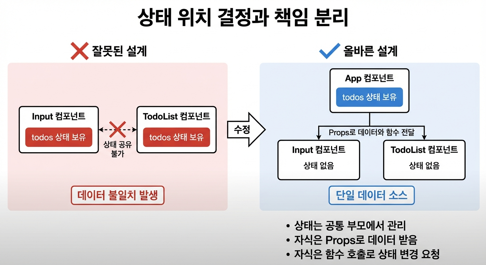

### 실습 경로 : my-react-app (12/10과 동일)
## 한 컴포넌트가 너무 많은 일을 하는건 좋지 않음
- 기능별로 컴포넌트를 구분하자

## React Todo App 구조설계

- App: todos 상태 관리, addTodo/deleteTodo 함수 제공
- Input: 사용자 입력 받기, 입력 텍스트 자체 상태로 관리
- TodoList:	todos 배열을 받아 TodoItem들 렌더링
- TodoItem:	개별 할 일 항목 표시, 삭제 버튼

<할 일 추가 흐름>


## 상태 위치 결정과 책임 분리

### 상태 위치 결정 원칙:
1. 여러 컴포넌트가 공유하는 상태 → 공통 부모에 배치
2. 한 컴포넌트만 사용하는 상태 → 해당 컴포넌트 내부에 배치

# let, useState, useRef
- 컴포넌트 안의 let은 다시 렌더링 될때마다 초기화됨
- useState의 값이 변할때마다 컴포넌트를 다시 렌더링함
- 렌더링해도 초기화는 되지 않으면서 컴포넌트를 다시 그릴 필요는 없는 값을 쓰고 싶다 => `useRef` 사용
```js
  console.log("렌더링 중");
  let countLet = 0;
  console.log("countLet 초기화 :: " + countLet);
  const [count, setCount] = useState(0);
  const countRef = useRef(0);

  const increaseState = () => {
    setCount(count + 1);
    console.log("useState ::::: " + (count + 1));
  };

  const increaseLet = () => {
    countLet++;
    console.log("countLet ::::: " + countLet);
  };

  const increaseRef = () => {
    countRef.current++;
    console.log("useRef ::::: " + countRef.current);
  };
```
- 각각 let, useState, useRef 값을 증가시키는 버튼이 있을 때
- let 증가 : 화면 변화 X, 다시 렌더링시 값 초기화
- useState : 화면 변화 O, 값 초기화 안됨
- useRef : 화면 변화 X, 값 초기화 안됨, 값 호출은 useRef.current를 사용해서 호출

## 그럼 Input이 여러개면 ref도 여러개를 써야하는가 - MyInputBox.jsx, MultiInputBox.jsx
- 필요한것만 꺼내서 구조분해 할당 가능
```js
  const [inputs, setInputs] = useState({
    title: "",
    price: "",
    desc: "",
    seller: "",
  });
  const { title, price, desc, seller } = inputs;

  const changeHandler = (e) => {
    // 이 때 값을 어떻게 저장해야 하는가
    const { name, value } = e.target;
    setInputs({
      ...inputs,
      [name]: value,
    });
  };
```
- e.target을 구조분해 할당해서 name, value를 가져옴, [name] 을 키값으로 쓰고 value는 value로 사용
- inputs로 useState를 만들고 title, price 등으로 input type="text"를 생성
- ...inputs로 inputs의 형식은 유지하면서 [name]:value로 값을 채워 새 객체를 생성, 반환
```js
      <label htmlFor="title"> title : </label>
      <input
        id="title"
        type="text"
        value={title}
        name="title"
        placeholder="상품이름을 입력하세요."
        onChange={changeHandler}
      />
```

# UseEffect - useEffectExam.jsx
```js
  // 1. 의존성 배열 없음. 매번 렌더링 될 때 실행됨 (거의 안씀)
  useEffect(() => {
    console.log("렌더링 시 매번 수행됨");
  });

  // 2. 의존성 배열이 빈 배열 [] 일 때 : API 호출, 라이브러리 초기와, 이벤트리스너 불러오기 등을 할 때 씀 (한번만 하니까)
  useEffect(() => {
    console.log("컴포넌트가 처음 실행될 때(마운트될 때)만 수행됨");
  }, []);

  // 3. 의존성 배열 [count] : count 값이 바뀔 때 마다 실행됨
  useEffect(() => {
    console.log("count 가 바뀔 때 마다 실행됨");
  }, [count]);
```

# 타이머 예제 - Timer.jsx, UseEffectToggle.jsx
```js
  useEffect(() => {
    console.log("useEffect[] 실행");
    // 1. 마운트 될 때 타이머 시작
    const timer = setInterval(() => {
      console.log("째깍째깍 .. (타이머 실행중)");
    }, 1000);
    // 2. Clean-up : 컴포넌트가 언마운트 될 때 실행
    return () => {
      clearInterval(timer);
      console.log("타이머 종료 (clean-up 실행)");
    };
  }, []);
```
## clean-up : 컴포넌트가 언마운트 될 때 실행
- 여기서 clearInterval을 해주지않으면 타이머가 안꺼짐