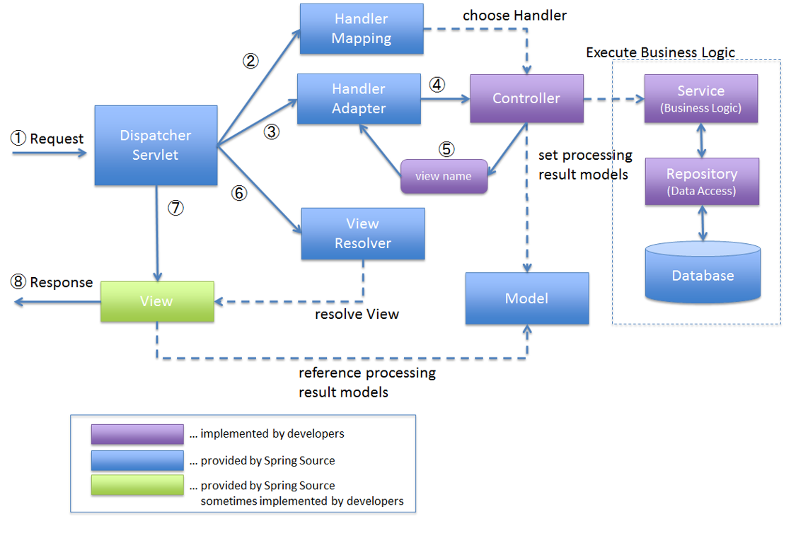

## IoC (Inversion of Control)
- 제어의 역전, 객체의 생명 주기를 스프링이 관리, 결합도를 낮춤
- 장점 : 코드변경에 유리, 유지보수가 편함

## IoC 컨테이너에게 Bean의 정보를 알려주는 방법
1. XML 파일을 이용 : 익숙해지면 편할 수 있지만 오타가 날 경우 실행시점에 오류가 발생
2. JavaConfig 사용 : 문제가 생기면 컴파일 단계에서 오류가 발생
3. 어노테이션 사용 : 내가 만든 객체가 아니면 붙일 수 없음

### 프레임워크는 완제품이 아닌 반제품이다.
- 무언가 자동으로 동작한다면 알려줘야할 정보가 있을 것이다.

## DI (Dependency Injection) : 의존성 주입
- 의존성을 외부에서 주입
1. 필드 주입 : 필드에 @Autowired 사용
2. 생성자 주입 : @Component + @Autowired | JavaConfig에 직접 등록
3. 설정자 주입 (Setter 메소드) : @Component + @Autowired | javaConfig에 직접 등록

## @SpringBootApplication
- 해당 어노테이션 사용 시 공장을 스프링부트가 자동으로 생성
- @Component를 알아서 읽어옴
- @Component가 없을 경우 JavaConfig에 @Configuration 추가해야함<br><br>

- UserDao 타입이 하나면 그냥 타입 맞는거 찾아서 연결, 두개면 연결 못함, repository 하나가 userDao로 ID를 설정하면 연결해줌
- @Qualifier("")로 주입을 받는 쪽에서 ID 지정을 할 수도 있음

## Bean 생명주기
- @Postcontruct : 초기화 시 실행
- @Predestroy : 종료 시 실행

## Profile
- 운영DB와 개발DB는 보통 다름
- @Profile, modify run configuration에서 active profiles로 구분해서 실행 가능 (IntelliJ 얼티밋에서 가능)
- application.properties에 설정가능
```
    // application.properties
    # 활성 프로파일 설정
    spring.profiles.active=dev

    # application-dev.properties
    server.port=8080
    logging.level.root=DEBUG

    # application-prod.properties
    server.port=80
    logging.level.root=INFO
```
- 이렇게 해도 modify run configuration에 설정한 profile이 우선순위를 가지고 있음

## @SpringBootApplication
- 클래스 파일이 있는 경로를 베이스 패키지로 설정하기 때문에 파일 생성시 run이 아닌 sample 폴더(상위폴더)에 있어야함

## CommandLineRunner
- 스프링부트가 동작한 후에 실행하고자 하는 코드가 있을 때 사용 (간단하게 테스트 할 내용이 있을 때 주로 사용)
1. CommandLineRunner를 implement 해서 run 메소드를 override, implement한 클래스 자체가 CommandLineRunner가 되고, Spring은 CLR을 찾아서 run을 실행.
2. @Bean으로 CommandLineRunner 객체를 생성
```java
    @Bean
    public CommandLineRunner commandLineRunner(Game game) {     // 람다식으로 run 메소드를 구현
        return args -> {
            game.play();
        };
    }
```

## 어노테이션
- 어노테이션도 따로 제작이 가능 (어노테이션.java 파일 생성)
- @Target() : 어노테이션을 어디에 붙이게 할지 설정이 가능 (ElementType.METHOD로 설정하면 메소드에만 붙일 수 있다)
- @Retention() : 언제 실행되게 할지 설정 (RUNTIME, CLASS, SOURCE ...)

## 로그 (Spring Boot 로깅 시스템)
### 로깅 (Logging) : 애플리케이션의 실행 중 발생하는 이벤트나 상태 정보를 기록하는 것
- 표준은 SLF4J (import시 SLF4J를 하는게 좋음)
- 장점 : 개발이 끝나고나서 "코드 수정 없이" 설정 파일 수정을 통해 출력여부, 출력위치(파일 등)를 결정할 수 있다. (System.out.println은 개발이 끝나면 다 빼줘야함)
- 로그의 레벨이 있어서 어떤 레벨까지만 출력할지도 설정할 수 있음
- 패키지 별로 출력 로그 레벨 설정 가능
- 레벨, 파일, 패턴, 그룹 설정 가능

### 로깅의 목적
- 디버깅: 개발 중 발생하는 문제 해결
- 모니터링: 운영 중 시스템 상태 추적
- 감사(Audit): 보안 및 규정 준수를 위한 기록
- 성능 분석: 병목 구간 및 성능 문제 파악
- 비즈니스 분석: 사용자 행동 패턴 분석

|     구분     | System.out.println()	 |    로깅 프레임워크     |
|:----------:|:---------------------:|:---------------:|
|     성능     |       동기 처리로 느림       |    비동기 처리 가능    |
|   레벨 제어    |         	불가능          |    로그 레벨별 제어    |
|   출력 대상    |        	콘솔만 가능        | 파일, DB, 네트워크 등  |
|    포맷팅     |         수동 처리         |     자동 포맷팅      |
|  운영 중 변경   |        	재배포 필요        | 설정 파일 수정만으로 가능  |

### 로그 레벨 계층
    TRACE < DEBUG < INFO < WARN < ERROR < FATAL(Log4j2 only)
|레벨|용도|            사용예시            |
|:---:|:---:|:--------------------------:|
|TRACE|매우 상세한 디버깅 정보|      	메서드 진입/종료, 변수 값      |     
|DEBUG|일반적인 디버깅 정보|      	중요 변수 상태, 흐름 제어      |
|INFO|일반 정보|   	애플리케이션 시작/종료, 주요 이벤트    |
|WARN|경고 메시지|  잠재적 문제, deprecated API 사용 |
|ERROR|오류 메시지|     	예외 발생, 복구 가능한 오류      |

## Properties / yml
- properties는 =을 기준으로 키-값을 이루고 있는데 키값이 잘못돼도 컴파일 오류가 안남
- yml은 컴파일 오류를 낼 수 있음

## Spring MVC
- 어플리케이션을 만들 때 전부 다 한 군데 모아서 하니까 수정하기도 힘들고 복잡함
- Model-View-Controller 으로 분리하자
- MVC 1 방식 : 서버에 진입할 수 있는 문이 페이지 수 (요청 수) 만큼 있음
  - 관리 힘듦
  - 보안 취약
- MVC model 2 : 어떤 요청이 와도 지나야 하는 문이 있음 (Front Controller)
- Spring MVC는 Dispatcher Servlet이 있음

## RESTController
- 응답을 자체적으로 함

## Controller
- View가 필요함

## 동작과정

0. Spring 서버가 올라가고, Bean등의 데이터를 수집하는 시점에서 Handler Mapping이 @Controller의 @GetMapping을 돌면서 url 저장
1. 페이지를 url이 요청, Dispatcher Servlet이 받음
2. Handler Mapping에게 어떤 컨트롤러가 할지 물어봄
3. Dispatcher Servlet가 Handler Adapter에게 대답받은 컨트롤러를 요청함
4. 해당 컨트롤러에게 보냄
5. 요청받은 컨트롤러는 view 이름을 Handler Adapter에게 반환
6. DS가 HA에게 받은 view의 이름을 토대로 VR에게 view의 자세한 정보 요청, 정보를 받음
7. view를 forwarding, 들어온 요청에 대해서 응답은 view가 하도록 넘김

## forwarding, redirecting
- 리다이렉트 : 요청 자체가 바뀜, 요청이 두개임 (클라이언트가 로그인 요청을 하고 로그인 성공 시 홈페이지로 다시 가도록 요청을 변경해서 다시 보냄)
- 포워딩 : 요청을 view가 처리하도록 넘김, 요청 하나에 대해서 파일이 움직임