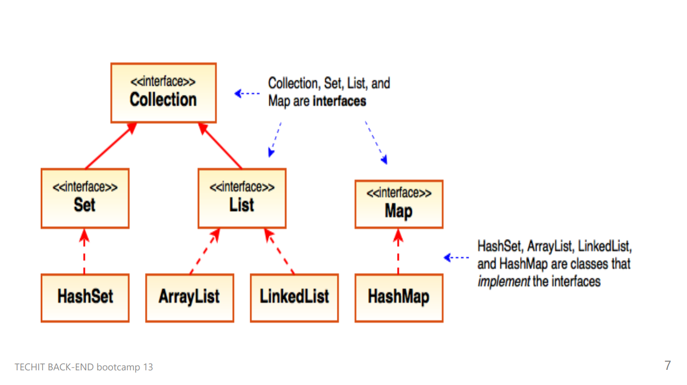

## 열거형 (Enum)
- 정해져 있는 값만 사용하고 싶을 때 열거형 타입을 사용하면 좋다
```java
public enum Day{
    MONDAY, TUESDAY, WEDNESDAY, THURSDAY, FRIDAY, SATURDAY, SUNDAY
}
```
- Day 타입에는 정해진 요일값만 들어갈 수 있음
- "yang" 같은 값을 넣으려고 하면 컴파일 단계부터 오류가 나도록 설계

## String
- 불변 클래스
- 문자열을 저장하는 특별한 공간을 사용함 (String Pool)

```java
String str = new String();  // 메모리 낭비
String str2 = "abd";        // 일반적인 사용법
str2 = str2 + "def";        // String은 append할 경우 다시 선언 필요
```
- String이 불변이라 문자열이 변경되는게 아니라 새로 생성됨, 메모리 관리에 불리
- 변경 가능하도록 만든 클래스 StringBuilder / StringBuffer

### 동기화
- 여러개의 흐름(스레드)에서 공유하는 자원이 있을 때 해당 자원에 대한  
접근을 제어하는것
- StringBuilder는 동기화 미지원, 속도가 빠름
- StringBuffer는 동기화 지원, 속도가 비교적 느림


## Math
- 수학과 관련된 메서드들이 선언되어 있는 클래스
- final 클래스 (상속불가)
- 메서드들이 static으로 선언되어 있다 (Math 객체를 생성할 필요 X)

## System 클래스
### Stream
- System.out
- System.in (키보드를 추상화)  

예시)
```java
Scanner sc = new Scanner(System.in);
int value = sc.nextInt();       // 입력받은 값을 int로 변환
String name = sc.nextLine();    // 입력받은 값을 String으로 변환

sc.close();                     // 이용 후 close 할 것

// 현재 시간 (밀리초)
System.out.println(System.currentTimeMillis());

// 배열 복사 (native 메소드로 빠름)
int[] src = {1, 2, 3, 4, 5};
int[] dest = new int[5];
System.arraycopy(src, 0, dest, 0, src.length);
```

## Wrapper 클래스
- 기본형 데이터를 객체로 다루기 위한 클래스 (왜? 기본형은 객체가 아니니까)
### 역할
- 객체가 아닌 기본타입을 객체로 변환
- 문자열을 각 데이터 타입으로 형변환
   - 자바 프로그램 외부로부터 입력받는 값들은 모두 문자타입
   - 자바 프로그램 내에서는 각 알맞는 데이터 타입으로 사용될 필요가 있다


- 박싱 : 기본타입을 객체인 타입으로 바꾸는 작업
- 언박싱 : 객체타입을 기본타입으로 바꾸는 작업

## 자료구조의 필요성
1. 효율적인 데이터 관리
2. 성능 최적화 (빠른 검색은 해시맵, 순서 유지가 필요하면 어레이리스트, 링크드리스트)
3. 재사용성 및 유지보수
4. 오류 방지

## 컬렉션 프레임워크
- 자바에서 데이터 집합을 효율적으로 처리할 수 있도록 설계된 표준화된 방법을 제공하는 인터페이스


- 종류 (크게 Set, List, Map 세 가지로 나뉨)


- Collection 인터페이스
  - Set : 순서가 중요하지 않음, 중복 허용 안함
  - List : 순서가 중요, 중복 허용
  - Queue : FIFO 구조를 가진 컬렉션, 링크드 리스트, 우선순위큐가 해당  


- Map 인터페이스: key-value 가 쌍으로 저장됨

## Iterator
- 컬렉션에 저장된 요소를 읽거나 제거하는 방법을 제공하는 인터페이스
- 순차적 접근, 안전한 요소 제거, 단방향 이동 기능을 제공
- hasNext() : 다음 요소가 있는지 확인 (boolean 반환)
- next() : 다음 요소를 반환
- foreach()를 쓰면 내부적으로 Iterator 사용함


## 제네릭(<>)을 쓰는 이유 ⭐
- 제네릭 없이도 ArrayList를 만들 수는 있음
- ArrayList를 예로 들면 데이터를 Object 타입으로 받는다 (모든 타입을 받을 수 있음)
- 모든 타입의 데이터를 저장할 경우 저장된 클래스의 메서드를 사용하려면 일일이 형변환을 해줘야함 (한가지 타입만 넣었다고 해도!)
- ArrayList에 들어갈 데이터 타입을 지정하는게 제네릭의 역할
```java
ArrayList list = new ArrayList();   // 제네릭 없이 생성한다면?
list.add("123");                    // String을 넣고 다시 쓰려면
((String)list.get(0)).trim();       // String 으로 형변환을 해줘야함
                                    // (Object 타입(부모타입)으로 저장이 되니까 자식의 메서드에 접근을 못함)

ArrayList<String> sList = new ArrayList<>();
// 어레이 리스트에 스트링 타입만 넣겠다
sList.add("123");
sList.add(11);      // String이 아니므로 컴파일할 때 부터 오류가 발생
```

## List를 구현하는 주요 클래스
- ArrayList
- LinkedList
- Vector
- Stack  

### List의 메서드
- add(a) : 데이터 a를 추가
- get(a) : a번 인덱스의 값을 리턴
- set(a, b) : a번 인덱스의 값을 b로 설정
- remove(a) : 데이터 a나 인덱스 a의 값을 리턴하고 삭제

값들을 담는 그릇 = 변수  
값들을 많이 담는 그릇 = 배열  
많은 값들을 좀 더 편하게 담는 그릇 = ArrayList, LinkedLIst, ...  

## Set
- 중복을 허용하지 않는 순서가 없는 자료구조
- 새로 만든 클래스의 타입을 넣는 경우는 equals(), hashCode()를 오버라이드 해야한다
- 두 메서드를 오버라이드 하지않으면 중복의 판단 기준이 없기 때문에 중복을 제거하지 않는다
- 순서가 없기 때문에 index를 통해 값을 꺼내는게 없음
- Iterator를 사용하면 모든 값을 꺼낼 수 있다.

## Map
- 키(Key)와 값(Value)의 쌍으로 데이터를 저장하는 자료구조
- 각 키는 고유하다.
- 키를 이용하여 값을 저장, 나중에 키로 해당 값을 검색
- 요소들의 순서는 보장하지 않음

### Map의 주요 메서드
- keySet() : key값만 Set형태로 반환
- values() : value값만 Collection형태로 반환
- put(a, b) : 키 a, 값 b로 데이터 삽입
- get(a) : 키 a에 해당하는 데이터 반환