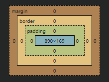

## NodeJS
- 자바스크립트를 브라우저 밖에서 동작할 수 있도록 하는 엔진

## NVM
- 노드 버전 관리 시스템

## 프로토콜
- 약속, 통신규약

## 웹 서버
- 정적인 것만 요청을 받아서 응답하는 간단한 서버 (정적)

## 웹 어플리케이션 서버
- 어플리케이션이 동작을해서 요청이 들어올때마다 새로운 응답을 만들어내는 서버 (동적)
- 해당 언어를 해석해서 프로그램을 돌려서 응답을 만들어내는게 필요 (자바의 경우는 서블릿이 그 역할을 함)

### HTTP 프로토콜은 클라이언트와 서버가 있어야 동작할 수 있다.

### 첫페이지는 대체로 index.html (변경가능)

### HTML의 모든 태그들은 박스 형식으로 이루어져 있다. 관리가 용이함
- 예전에는 div 박스를 사용했음 (의미없는 박스)
- 서치엔진에 보여주기 좋게 페이지를 구성할 때 의미있는 태그가 필요

### 블록태그 : 한 줄을 전부 차지하는 태그
### 인라인태그 : 컨텐츠의 크기 만큼만 자리를 차지하는 태그

-------------------

## 폼태그 ⭐⭐⭐
- 클라이언트에서 서버쪽에 정보를 전달할 수 있는 부분
- 정보의 종류에 따라 url과 같이 보낼때도 있고, body에 넣어서 보낼때도 있음
- action의 method 설정으로 결정함
- POST : 데이터를 body에 포함시켜 전달
- GET : 데이터를 url에 포함시켜 전달
- 다양한 입력 타입이 있다.

## 시맨틱 태그
- header, main, footer, nav 모두 박스의 종류 (시맨틱태그)
- 전부 div박스에 id를 부여해서 사용했었음
- 태그 자체가 뭘 하지는 않음
- 접근성 향상, SEO 최적화, 유지보수 용이, 표준 준수(HTML5 웹 표준)
- span : 줄넘김을 하지 않음 컨텐츠를 묶기만함 (인라인레벨인걸 여러개 묶을 때)
- div : 해당 컨텐츠를 묶고 줄 구분을 함 (블럭레벨인걸 여러개 묶을 때)

----------------

## CSS (Cascading Style Sheets)
- HTML 문서의 표현을 기술하는 스타일시트 언어
- 구조(HTML)와 표현(CSS)의 분리
- 유지보수 용이성 향상

### 선택자
- 어떤 태그에게 스타일을 적용할지 지정할때 씀
- \* : 모든 요소 선택 (바람직하지 않음), 기본 css 초기화 소스는 모든 태그를 다 적어놨음
- 태그 선택자 (타입 선택자) : 태그명을 입력하고 스타일을 지정
    - 태그 선택자의 문제 : 동일한 태그가 여러개인데 다르게 표현하고 싶은 경우를 처리 못함<br><br>

- 태그 선택자 1, 클래스 선택자 10, ID 선택자 100 정도의 가중치를 가진다.
  - 같은 태그 선택자의 경우 나중에 선언된게 우선적으로 적용.
  - 태그 : p { }, 클래스 : .a { }, ID : #b { }<br><br>

- 자손 선택자 : 특정 태그 안에 있는 태그를 선택하는 선택자
- div안의 p태그에만 지정하겠다는 의미, 그냥 p태그는 적용되지 않음
```html
<style>
    div p {
        ...
    }
</style>
```

<br><br>
- 같은 ID를 한 페이지에서 여러번 쓰지 않는다.
- 클래스는 여러개 나와도 괜찮다.
- 스타일 지정은 ID보다 클래스를 사용하는게 좀 더 바람직
```html
<p class="a aa">아</p> /* 클래스 선택자 a와 aa 두개를 사용 */
```

1. 인라인 스타일 : html 태그에 직접 css 내용을 넣음 (권장하지 않음 : HTML과 CSS는 분리하는게 좋음)
2. 내부 스타일 시트 : head 태그 내에 style 태그로 설정
3. 외부 스타일 시트 : 따로 css 파일을 만들어서 설정 후 연결
```html
<link rel="stylesheet" href="styles.css" />
```
- 모든 태그는 박스로 이루어져 있다
- 밖에서부터 margin, border, padding, content 순으로 되어있음


## CSS의 핵심 : HTML 요소를 찾는것

- font-family : 사용자 PC에 지정 폰트가 없을걸 대비해서 여러 폰트를 설정해놓는것
- font-weight : 글자 굵기의 정도
- letter-spacing : 자간
- text-indent : 들여쓰기
- text-decorating : 밑줄 등등<br><br>

- div의 기본 설정 : 블럭 레벨 (한 줄 다 차지함)
- 블럭 레벨일 때만 width, height 값 설정이 가능. inline 레벨은 불가능
- 크기도 정하면서 박스도 한줄에 넣고 싶다 --> display: inline-block 사용
- padding 값
  - 60px -> 4방향 모두 60px
  - 60px 70px -> 위아래 60, 양 옆 70
  - 60px 70px 80px -> 위 60, 아래 70, 양 옆 80
  - 60px 70px 80px 90px -> 위 60, 오른쪽 : 70, 아래 : 80, 왼쪽 90<br></br>

- margin : 박스와 다른 박스의 간격, 세팅값 순서는 padding과 동일
    - 마진은 값이 합산되는게 아니라 큰 마진이 적용됨 (마진 상쇄)
    - 위 박스의 아래 마진 30, 아래 박스의 위 마진 20일 경우 30만큼 간격이 생김
    - 마진값을 마이너스로 주면 박스 겹치기 가능<br></br>

- visibility : hidden -> 박스가 안보이게 함, 공간은 차지 (안보이는 박스가 존재)
- display : none -> 박스를 아예 안갖다놓음, 공간 차지 안함 (박스 자체가 없음)
- opacity : 0.5 -> 박스의 투명도를 조절, 기본값 1
- border : 박스의 테두리를 그림