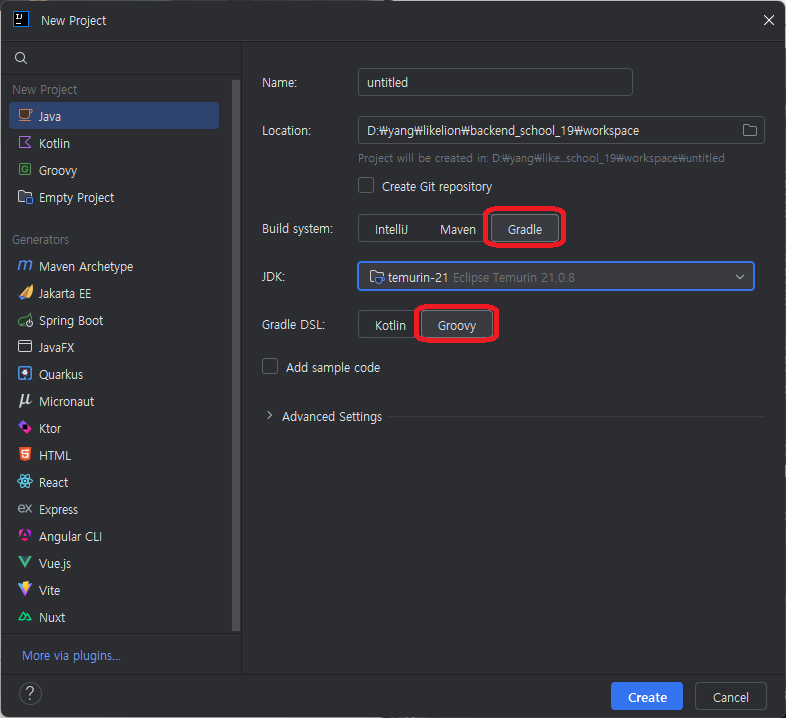

## theta join
- 두 테이블 사이에 PK, FK 같은 관계는 없지만 연결되어 있는 join

## rank()
- 뒤에 over를 사용해서 순위에 대한 기준 제시
- over 안에 partition by를 사용하면 그룹화를 해서 순위를 매김

# Docker cmd 명령어
- docker ps : 현재 올라가있는 컨테이너 확인 가능
- docker exec -it 컨테이너명 /bin/bash : 컨테이너 실행, 배쉬로 진입
- mysql -u유저명 -p비밀번호 : 유저명 비밀번호로 mysql 접속
- exit : 종료

## JDBC
1. Connection은 인터페이스라 자바 표준만 정의
2. MySQL 드라이버가 구현한 클래스를 제공
3. Class.forName("com.mysql.cj.jdbc.Driver")는 드라이버를 등록하는 역할
4. DriverManager.getConnection() 호출 시 생성

## Maven
- 프로젝트마다 라이브러리 불러오기 귀찮아서 만듬
## Gradle
- 메이븐 xml도 무거워서 만듬

## Gradle 설정
- File -> Setting -> Build, Execution~ -> Build Tools -> Gradle -> Build and run using / Run tests using : IntelliJ IDEA로 변경

## 수정(UPDATE), 삭제(DELETE) 
- UPDATE 테이블명 SET 컬럼명 = '수정할 값', 컬럼명 = '수정할 값' WHERE 조건
- DELETE FROM 테이블명 WHERE 조건
- WHERE절 없으면 모든 데이터 처리

## 인덱스(INDEX)
- 데이터 검색속도를 향상시키기 위한 자료구조
- 인덱스로 사용하기 좋은 컬럼
    - 조회 조건에 자주 쓰이는 컬럼
    - 값의 분포도가 넓은 컬럼
```mysql.sql
CREATE INDEX books_author_idx on books(author);
```
- ON DELETE CASCADE : FOREIGN KEY에 사용하는 조건, 연결되어 있는 데이터가 삭제되면 같이 삭제되도록 연동

## 트랜잭션 (Transaction)
- DB에서 하나의 작업으로 처리되는 논리적 작업 단위, 나눌 수 없는 작업 단위
- autocommit 옵션을 끌 경우 다른 세션에서 데이터 수정을 하면 그 외 세션은 건드릴 수 없음. commit rollback 둘 중 하나는 해야함

## ALTER TABLE
- 컬럼 추가/삭제/수정
```mysql.sql
-- 컬럼 추가
ALTER TABLE board 
ADD COLUMN updated_date TIMESTAMP NULL;

-- 컬럼 수정
ALTER TABLE board 
MODIFY COLUMN title VARCHAR(200) NOT NULL;

-- 컬럼 이름 변경
ALTER TABLE board 
CHANGE COLUMN content contents TEXT;

-- 컬럼 삭제
ALTER TABLE board 
DROP COLUMN updated_date;
```

## JDBC(Java DataBase Connectivity)
- 자바 어플리케이션에서 데이터베이스에 접속하고 SQL을 실행하기 위한 표준 API

### gradle 의존성 추가

- gradle, groovy 선택 후 프로젝트 생성
- 프로젝트 내 build.gradle 파일열고 dependencies에 내용 추가
```java
implementation 'mysql:mysql-connector-java:8.0.31'
```

## INSERT 테스트 코드
```java
import java.mysql.sql.Connection;
import java.mysql.sql.DriverManager;
import java.mysql.sql.PreparedStatement;

public class InsertTest {
    public static void main(String[] args) throws Exception {
        // 0. 드라이버로딩 (MySQL 드라이버를 메모리에 올려준다)
        // 최신 버전은 알아서 해줌, 생략 가능
        // Class.forName("com.mysql.cj.jdbc.Driver");

        // 1. 접속 :  Connection 을 얻어내는 일
        String url = "jdbc:mysql://localhost:3306/liondb";      // DBMS마다 원하는 url 형식이 조금씩 다름
        String user = "root";       // root 접속은 바람직하지는 않음
        String password = "root1234";
        Connection conn = DriverManager.getConnection(url, user, password);

        // 2. 쿼리 작성 : Statement(쿼리를 추상화한 객체), PreparedStatement
        // 쿼리문이 실행될 때 DBMS가 알아들을 수 있게 번역(파싱) 된다.
        // 같은 쿼리가 또 들어오면 이미 번역한 것을 사용한다.

        // insert into students(name) values('kang');
        // insert into students(name) values('hong');
        // insert into students(name) values('kim');
        // 위 세개의 쿼리는 각자 다른 쿼리로 인식, statement는 값까지 들어간 완벽한 쿼리로 실행된다.
        // insert into students(name) values (?); -- PreparedStatement는 여기까지 미리 번역해놓음, ?값이 달라져도 미리 번역해놓은걸 사용
        // PreparedStatement 사용 예정
        String mysql.sql = "insert into dept(deptno, dname, loc) values (?, ?, ?)";
        PreparedStatement ps = conn.prepareStatement(mysql.sql);
        // 반드시 ? 에 값을 채워줘야함
        ps.setInt(1, 50); // 1번째 ?에 50을 넣는다.
        ps.setString(2, "lion"); // 2번째 ?에 lion을 넣는다
        ps.setString(3, "Seoul"); // 3번째 ?에 Seoul을 넣는다.

        // 3. 실행!
        // ps.executeQuery();  // resultSet을 반환, (조회 할 때 사용)
        int resultCount = ps.executeUpdate(); // int를 반환 (등록, 수정, 삭제할 때 사용)

        if (resultCount == 1)
        {
            System.out.println("입력성공");
        }

        ps.close();
        conn.close();
    }
}
```
- 쿼리를 작성했으면 실행을 해야한다 -> executeQuery(), executeUpdate() 두 종류
- executeQuery() : resultSet을 반환, 조회 시 사용
- executeUpdate() : int를 반환, 등록, 수정, 삭제 시 사용

### PreparedStatement
- 그냥 Statement는 값까지 포함하기 때문에 값만 다른 쿼리여도 전부 다른 쿼리로 인식
- 그래서 값 부분을 ? 처리한 PreparedStatement를 만듬
- ? 처리한 값은 채워줘야함

### statement와 connection은 사용 후 닫아주는게 좋다.
- statement.close()
- connection.close()